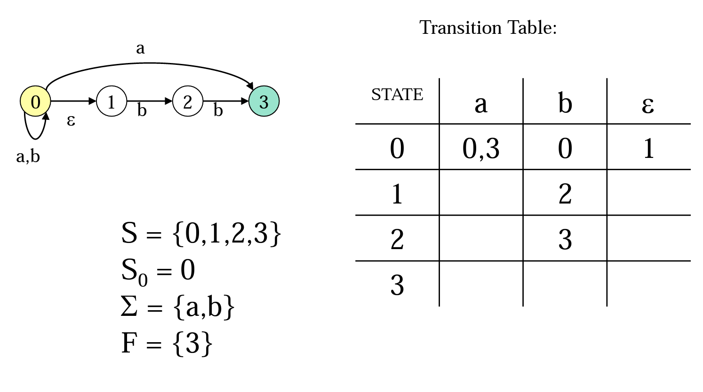

## README
This program assignment is very interesting. I spend much time and finally figure it out. First, the grammar structure of input file is given to us.  
```
input      --> grammar strings grammar    
           --> grammar production             
           |  production 
production --> NT ARROW T NT EOL             
           |  NT ARROW NT EOL             
           |  NT ARROW EOL 
strings    --> strings string EOL             
           |  string EOL 
string     --> string T             
           |                /* epsilon */
```  
The meaning of this grammar is simple. `input` represents the whole input file. `input` can be separated to two parts: one is `production`, another is `strings`. `strings` consists of multiple lines of `string`. `string` consists of multiple `Terminal` which is lower case alphabetic character. Here comes a sample input file,  
```
A1 -> a A2
A2 -> a A1
A1 ->
aaaa

aaa
```
First three lines belong to `production`, and last three lines belong to `strings`. We are required to write a parser depends the given grammar to decide the components of the grammar. My parser can identify which is `NT` in `production` or which is T in `string`. With this work, I can build up a NFA table, which can be used to validate the string at last three lines.  
The basic workflow would be like:  
1. A scanner would return token with each lexeme
2. Before writing a parser, I need to convert it to LL1
3. Write a recursive descent parser based on LL1 grammer
4. During parsing, store the NFA transition table in data structure designed by myself
5. Use stored transition table to validate string with backtracking.  

## 2 - convert to LL1
AFTER eliminating left recursion,  
```
input -> grammar strings             {NT}
grammar -> production grammar'       {NT}
grammar' -> production grammar'      {NT}
grammar' -> epsilon                  {T, EOL}
production -> NT ARROW production'   {NT}
production' -> T NT EOL              {T}
production' -> NT EOL                {NT}
production' -> EOL                   {EOL}
strings -> string EOL strings'       {T, EOL}
strings' -> string EOL strings'      {T, EOL}
strings' -> epsilon                  {$}
string -> string'                    {T, EOL}
string' -> T string'                 {T}
string' -> epsilon                   {EOL}
```  
I also list the predict set on the righthandside to make sure they don't have conflict (if conflict, it means not LL1).

## 3 - Write a RDP based on LL1 grammar
For example, https://github.com/shinmao/Compiler101/blob/main/src/parser/CS540-PA2/parser.c#L163  
The code at line 163 showed the rule for `production'`.

## 4 - NFA transition table  
  
The indexes of two dimensions would be string; therefore, I design a two dimensional dictionary.

## 5 - Use NFA table to validate strings
https://github.com/shinmao/Compiler101/blob/main/src/parser/CS540-PA2/parser.c#L52  
At line 52, `trans1` was used to see whether there we can transite to another state with current input. `trans2` was used in the case that state can transite without any input, which is called `epsilon-transition`.

## Feedback
I spend most of the time to implement data structure because C doesn't provide dictionary by default. Maybe some days I would need to prepare my own data structure implementation in advance:)
